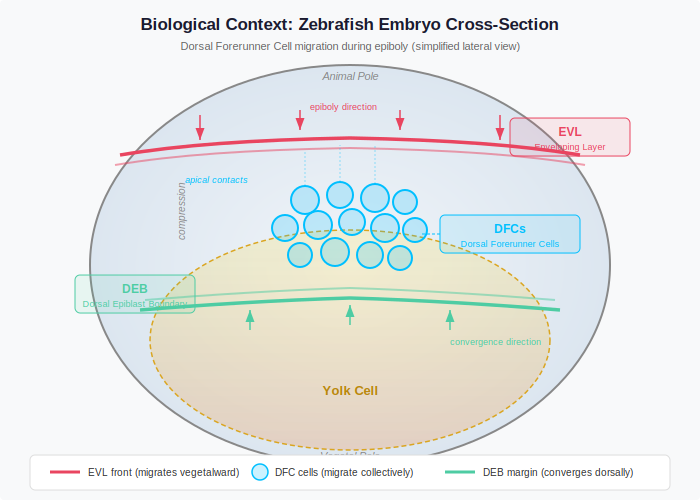
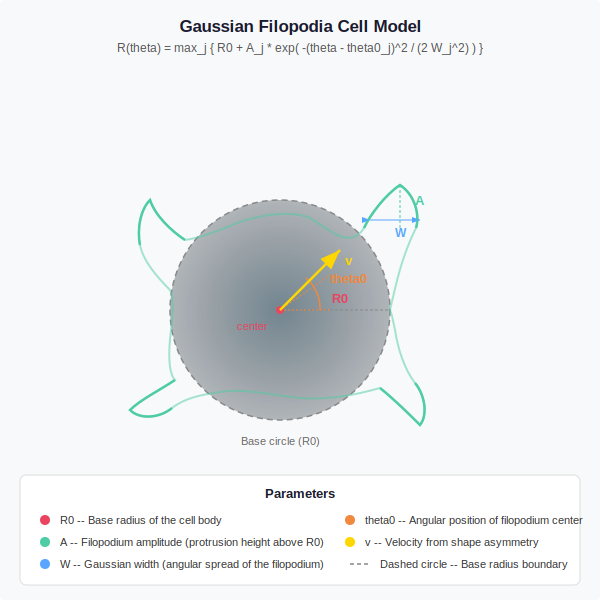
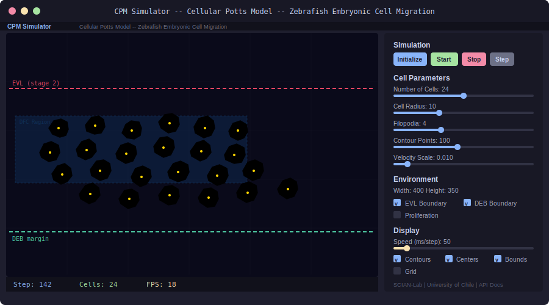
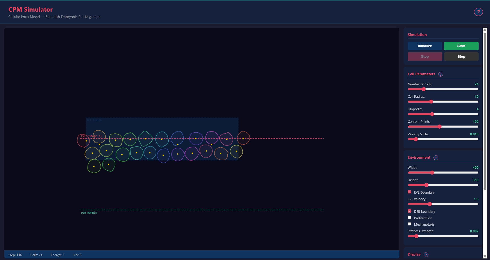
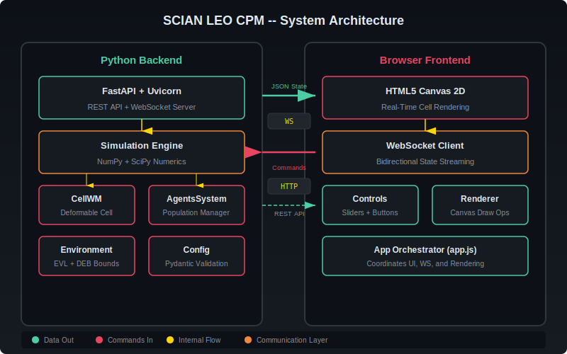

# SCIAN LEO CPM

**Cellular Potts Model simulator for zebrafish embryonic cell migration.**

An interactive web application that models the collective migration of Dorsal Forerunner Cells (DFCs) during Kupffer's vesicle formation in zebrafish embryos. Cells are represented as deformable bodies with Gaussian filopodia-driven motility, moving between two advancing tissue boundaries (EVL and DEB) in real time.

---

## Motivation & Problem

Understanding how cells migrate collectively during embryonic development is fundamental to developmental biology. During zebrafish gastrulation, Dorsal Forerunner Cells (DFCs) form a cohesive cluster that migrates toward the vegetal pole, forming Kupffer's vesicle — the left-right symmetry organizer. How individual cell behaviors (filopodial protrusion, adhesion, mechanotaxis) give rise to collective migration remains an open question.



---

## KPIs — Impact & Value

| KPI | Impact |
|-----|--------|
| Simulation accessibility | Replaces C++/CLI Windows-only app with cross-platform web browser |
| Biological fidelity | Models 5 cell behaviors (filopodia, adhesion, CIL, durotaxis, division) in one framework |
| Parameter exploration | Interactive — adjust any parameter in real-time vs recompile C++ |
| Research reproducibility | Python + open source vs proprietary Visual Studio 2012 toolchain |

## Cell Model

Each cell is a 2D deformable body whose membrane is the envelope of multiple Gaussian peaks in polar coordinates. Filopodia extend the boundary, break symmetry, and drive cell motion.



---

## Application Screenshot

The application provides a dark-themed interface with a simulation canvas on the left and interactive controls on the right.



## Frontend



---

## Technical Approach — Cell Dynamics Model

### Cell Shape — Gaussian Filopodia Envelope
Each cell's boundary represents membrane protrusions driven by actin polymerization. The shape is the envelope of multiple Gaussian peaks, each modeling a filopodium:

```
R(θ) = max_j { R₀ + Aⱼ · exp(-(θ - θⱼ)² / (2Wⱼ²)) }
```

where **R₀** is the base cell radius (resting shape), **Aⱼ** is the protrusion height of filopodium j, **θⱼ** its angular position, and **Wⱼ** its Gaussian width. The `max` operator creates an irregular boundary — more filopodia produce more complex cell shapes, consistent with migratory cell morphology.

### Migration — Filopodia-Weighted Propulsion
Cells move by generating traction forces at filopodial tips. The velocity is the vector sum of all filopodial contributions, weighted by adhesion maturation:

```
v = V₀ · Σⱼ (adhesionⱼ + 0.1) · Aⱼ · (cos θⱼ, sin θⱼ)
```

where **V₀** is the velocity scale and **adhesionⱼ ∈ [0,1]** reflects focal adhesion maturation. The (0.1) baseline ensures motility even without mature adhesions. Filopodia clustered on one side produce directed migration.

### Energy Monitoring — Hamiltonian
The cell shape energy penalizes deviations from target area and perimeter:

```
H = λ_A · (A − A₀)² + λ_P · (P − P₀)²
```

where **A₀ = πR₀²** and **P₀ = 2πR₀** are the resting area and perimeter. This monitors cell health — high energy indicates extreme deformation.

### Durotaxis — Substrate Stiffness Sensing
Filopodia rotate toward stiffer substrate via a sinusoidal torque:

```
Δθⱼ = α · |∇E| · sin(θ_gradient − θⱼ)
```

The **sin** function creates a restoring torque: filopodia aligned with the stiffness gradient (∇E) feel no torque; perpendicular ones feel maximum rotation. This models focal adhesion reinforcement on stiffer substrates.

---

## Architecture



---

## Features

- **Deformable cell model** -- Gaussian filopodia create realistic protrusions with elastic membrane dynamics
- **Real-time visualization** -- HTML5 Canvas 2D rendering at 10-50 FPS with per-cell color coding
- **WebSocket streaming** -- low-latency bidirectional communication between server and browser
- **Interactive controls** -- sliders and buttons for cell count, radius, filopodia, velocity, and more
- **Tissue boundary dynamics** -- EVL epiboly front with 6-stage adhesion model and DEB convergence margin
- **Two-pass collision resolution** -- forward soft pass + backward hard pass prevents overlap and oscillation
- **REST API** -- full simulation control via HTTP with automatic Swagger/ReDoc documentation
- **Cell proliferation** -- configurable 8-stage schedule for cell division
- **Cross-platform** -- runs on any OS with Python 3.10+ and a modern browser

## Project Metrics & Status

| Metric | Status |
|--------|--------|
| Tests | 19 passing |
| Cell behaviors | 5 (filopodia, adhesion, CIL, durotaxis, Hertwig division) |
| Collision algorithm | Two-pass O(n²), <1ms for 24 cells |
| Vectorization | NumPy broadcasting for adhesion, contour generation |
| Frontend | HTML5 Canvas + WebSocket real-time streaming |

---

## Quick Start

```bash
# Clone and setup
cd SCIAN_LEO_CPM
python -m venv .venv
source .venv/Scripts/activate  # Windows Git Bash
pip install -r requirements.txt

# Run tests
python tests/test_cell.py
python tests/test_agents.py
python tests/test_simulation.py

# Start the application
python -m uvicorn app.main:app --reload --port 8001

# Open in browser
# http://localhost:8001
```

For macOS/Linux, use `source .venv/bin/activate` instead.

### Tests

```bash
# Run all tests with pytest
python -m pytest tests/ -v

# Or run individually
python tests/test_cell.py
python tests/test_agents.py
python tests/test_simulation.py
```

---

## Project Structure

```
SCIAN_LEO_CPM/
├── app/
│   ├── __init__.py
│   ├── main.py                    # FastAPI entry point, REST + WebSocket endpoints
│   ├── config.py                  # Default configuration (Pydantic models)
│   ├── simulation/                # Core simulation engine
│   │   ├── __init__.py
│   │   ├── cell.py                # CellWM: deformable cell with Gaussian filopodia
│   │   ├── agents.py              # AgentsSystem: population, collisions, proliferation
│   │   ├── environment.py         # EnvironmentSystem: domain, EVL/DEB boundaries
│   │   └── math_utils.py          # Vector math, angle normalization helpers
│   ├── api/
│   │   ├── __init__.py
│   │   └── websocket.py           # WebSocket endpoint and docs
│   └── static/                    # Browser frontend
│       ├── index.html             # Single-page application
│       ├── css/style.css          # Dark-theme stylesheet
│       └── js/
│           ├── app.js             # Main orchestrator
│           ├── renderer.js        # Canvas 2D rendering
│           ├── controls.js        # UI control bindings
│           └── websocket.js       # WebSocket client with auto-reconnect
├── tests/
│   ├── __init__.py
│   ├── test_cell.py               # CellWM unit tests
│   ├── test_agents.py             # AgentsSystem unit tests
│   └── test_simulation.py         # Integration tests
├── notebooks/
│   └── parameter_exploration.py   # Parameter sweep and analysis scripts
├── docs/
│   ├── architecture.md            # System design, API protocol, data flow
│   ├── biological_model.md        # Cell model math, collision algorithm, boundaries
│   ├── development_history.md     # Changelog, C++ to Python migration history
│   ├── references.md              # Publications and software references
│   ├── user_guide.md              # Installation, usage, troubleshooting
│   ├── png/
│   │   └── frontend.png           # Frontend screenshot
│   └── svg/
│       ├── architecture.svg       # System architecture
│       ├── cell_model.svg         # Gaussian filopodia concept
│       ├── simulation_flow.svg    # Simulation step pipeline
│       ├── biological_context.svg # Zebrafish embryo cross-section
│       ├── app_screenshot.svg     # Application interface
│       ├── comparison_table.svg   # Model comparison table
│       ├── durotaxis_model.svg    # Durotaxis model diagram
│       └── velocity_comparison.svg # Velocity comparison diagram
├── legacy/                        # Previous C++/CLI codebase (2014-2024)
├── build.spec                     # PyInstaller spec file
├── Build_PyInstaller.ps1          # PowerShell build script
├── run_app.py                     # Uvicorn launcher with auto-browser
├── requirements.txt               # Python dependencies
└── README.md                      # This file
```

---

## API Documentation

The server automatically generates interactive API documentation:

- **Swagger UI**: http://localhost:8001/docs
- **ReDoc**: http://localhost:8001/redoc

### REST Endpoints

| Method | Endpoint                   | Description                          |
|--------|----------------------------|--------------------------------------|
| GET    | `/`                        | Serve the web application            |
| POST   | `/api/simulation/init`     | Initialize simulation with config    |
| POST   | `/api/simulation/start`    | Start continuous simulation          |
| POST   | `/api/simulation/stop`     | Pause simulation                     |
| POST   | `/api/simulation/step`     | Advance one step, return state       |
| GET    | `/api/simulation/state`    | Query state without advancing        |

### WebSocket

Connect to `ws://localhost:8001/ws/simulation` for real-time bidirectional streaming. Send JSON commands (`start`, `stop`, `speed`, `init`) and receive full state snapshots each step.

### Example: initialize and step via curl

```bash
# Initialize with 30 cells
curl -X POST http://localhost:8001/api/simulation/init \
  -H "Content-Type: application/json" \
  -d '{"num_cells": 30, "cell_radius": 8}'

# Advance one step
curl -X POST http://localhost:8001/api/simulation/step
```

---

## Port

**8001** -- http://localhost:8001

---

## Documentation

| Document | Description |
|----------|-------------|
| [Architecture](docs/architecture.md) | System design, technology choices, API protocol, data flow, deployment |
| [Biological Model](docs/biological_model.md) | Gaussian filopodia math, cell dynamics, collisions, boundary model |
| [Development History](docs/development_history.md) | Project origins (C++/CLI 2014), migration to Python, changelog |
| [References](docs/references.md) | Key publications and software dependencies |
| [User Guide](docs/user_guide.md) | Installation, UI walkthrough, API examples, troubleshooting |

---

## References

- Graner & Glazier (1992). Simulation of biological cell sorting using a two-dimensional extended Potts model. *Physical Review Letters*, 69(13).
- Wortel & Textor (2021). Artistoo. *eLife*, 10:e61288.
- Oteiza et al. (2008). Origin and shaping of the laterality organ in zebrafish. *Development*, 135(16).
- Ablooglu et al. (2021). Apical contacts stemming from incomplete delamination. *eLife*, 10:e66495.
- Rieu et al. (2000). Diffusion and deformations of single Hydra cells in cellular aggregates. *Biophysical Journal*, 79(4).

See [docs/references.md](docs/references.md) for the full annotated reference list.

---

## License

This project is developed by the **SCIAN-Lab** (Scientific Image Analysis Laboratory) at the University of Chile. Contact the authors for licensing information.
