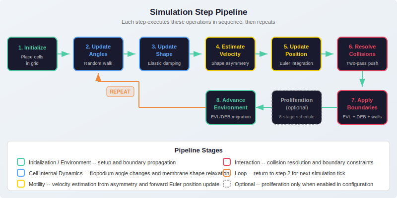

# Biological Model

## Biological Background

During the early stages of zebrafish development, a small group of specialized cells called **Dorsal Forerunner Cells (DFCs)** must travel together through the developing embryo to reach a precise location where they will assemble into a structure known as **Kupffer's vesicle**. This vesicle is the organ responsible for establishing the left-right body axis -- without it, the zebrafish would not develop proper internal organ placement.

The DFC migration takes place while the embryo is undergoing a large-scale tissue movement called **epiboly**, in which the outer cell layers spread from the top of the embryo (the animal pole) toward the bottom (the vegetal pole) to cover the yolk cell. The DFCs are physically attached to the outermost layer, the **Enveloping Layer (EVL)**, through thin cellular connections called apical contacts. As the EVL spreads downward, it drags the DFCs along with it.

At the same time, the **Dorsal Epiblast Boundary (DEB)** converges from the opposite direction, compressing the DFC cluster from below. The DFCs are therefore squeezed between two advancing tissue fronts, and their collective migration is shaped by this mechanical confinement.

This simulator models the behavior of a population of 20-30 DFCs within this dynamic environment. Each cell is represented as a deformable body that can extend protrusions (filopodia) in random directions, and the resulting shape asymmetry drives the cell's motion.


---

## The Gaussian Filopodia Mathematical Model

### Cell Shape Representation

Each cell is described by a central position (x, y) and a radial contour function that defines the distance from the center to the membrane at every angle. The contour is not a simple circle: it has multiple bumps corresponding to filopodial protrusions.

The radial distance at any angle theta is computed as the **envelope** (maximum) across all filopodia:

```
R(theta) = max over j of { R0 + A_j * exp( -(theta - theta0_j)^2 / (2 * W_j^2) ) }
```

Where the parameters are:

| Symbol    | Name              | Meaning                                                     |
|-----------|-------------------|-------------------------------------------------------------|
| R0        | Base radius       | The resting radius of the cell when no filopodia are active |
| A_j       | Amplitude         | How far filopodium j extends beyond the base radius         |
| theta0_j  | Angular position  | The direction in which filopodium j points                  |
| W_j       | Gaussian width    | The angular spread of the filopodium (broader = blunter)    |

The `max` operator ensures that the cell boundary is always at least as far as the largest filopodium at each angle. Where filopodia overlap in angle, the outermost one wins.


### Discretization

The continuous contour function is evaluated at a fixed set of equally-spaced angles from -pi to +pi. The default is 100 points, producing a smooth polygon. Each contour point is stored as a Cartesian coordinate pair:

```
contour[i] = ( center_x + R(theta_i) * cos(theta_i),
               center_y + R(theta_i) * sin(theta_i) )
```

---

## Cell Dynamics

Each simulation step applies four sequential operations to every active cell. These are described below in the order they are executed.



### 1. Angle Update (Brownian Random Walk)

Every filopodium has an angular position theta0_j that changes randomly at each step, modeling the biological observation that filopodia constantly extend and retract in different directions. The update rule is:

```
theta0_j(t + dt) = theta0_j(t) + (pi / 4) * sigma_j * U(-0.5, 0.5)
```

Here, `sigma_j` is a per-filopodium step size parameter (randomly assigned at cell creation) and `U(-0.5, 0.5)` is a uniform random number between -0.5 and +0.5. The factor `pi/4` keeps the maximum single-step rotation within a 45-degree range. After the update, the angle is wrapped to the interval [-pi, pi] to prevent unbounded growth.

This random walk makes the cell constantly explore new directions, which is essential for realistic motility. Without it, cells would move in straight lines determined by their initial filopodium configuration.

### 2. Shape Update (Elastic Membrane Relaxation)

After the filopodium angles change, the membrane must adapt to the new configuration. This is done through an elastic damping process: each contour point moves partway from its current radial distance toward the ideal distance defined by the nearest filopodium.

For each contour point at angle theta_i:

```
For each filopodium j:
    ideal_r_j = R0 + A_j * exp( -(theta_i - theta0_j)^2 / (2 * W_j^2) )
    candidate_j = current_r - gamma_j * (current_r - ideal_r_j)

new_r = max( R0, max over j of { candidate_j } )
```

The damping coefficient `gamma_j` controls the relaxation speed. When `gamma_j` is close to 1, the membrane snaps instantly to the target shape. When `gamma_j` is small, the membrane responds sluggishly, creating a more viscous (slow-moving) membrane behavior.

The final radius at each angle is clamped to be at least R0, ensuring the cell never collapses below its base size.

### 3. Velocity Estimation (Shape Asymmetry)

The cell's velocity is computed from the asymmetry of its membrane contour. The idea is that a cell with a protrusion extending in one direction will have more membrane area on that side, and the net effect pulls the cell toward the protrusion.

The velocity components are:

```
v_x = s * sum over i of { r_i * cos(theta_i) }
v_y = s * sum over i of { r_i * sin(theta_i) }
```

Where `r_i` is the radial distance at contour point i, `theta_i` is the angle of that point, and `s` is the velocity scale factor. For a perfectly circular cell, the sum of `r * cos(theta)` over equally-spaced angles cancels out to zero, producing no net motion. A cell with one large protrusion will have a net velocity pointing toward that protrusion.

The velocity scale `s` (default: 0.01) controls the overall speed of cell migration. Smaller values produce slower, more compact cell clusters; larger values produce faster, more dispersed populations.

### 4. Position Update (Forward Euler Integration)

The simplest possible time integration: the cell center is advanced by adding the velocity:

```
position(t + dt) = position(t) + velocity(t)
```

This is a first-order explicit scheme (forward Euler). It is adequate here because the simulation time step is small relative to the velocity magnitudes, and the collision resolution in the next phase corrects any overshooting.

---

## Collision Detection and Resolution

### Algorithm

After all cells have moved in a given step, the system checks for overlapping cells and pushes them apart. Two cells are considered overlapping when the distance between their centers is less than the sum of their base radii.

The resolution uses a **two-pass algorithm** to ensure robust separation without oscillation:

**Forward pass (soft collision):**
- Iterate through all pairs (i, j) where i < j.
- If cells overlap, push them apart along the axis connecting their centers.
- The push uses a softness factor of 1.0, which allows some residual overlap.

**Backward pass (hard separation):**
- Iterate through all pairs in reverse order.
- Push overlapping cells fully apart with a softness factor of 0.0.

The push magnitude is proportional to the overlap distance:

```
overlap = (radius_A + radius_B) - distance(A, B)
push = overlap * (1.0 - factor * 0.5)
```

Each cell is displaced by half the push distance in opposite directions along the connecting axis. After displacement, both cell contours are rebuilt to match their new positions.

### Why Two Passes?

A single pass can leave residual overlaps when fixing one pair pushes cells into a new overlap with a third cell. The backward pass catches and resolves these secondary overlaps. The soft-then-hard approach prevents oscillation: the forward pass does the bulk of the work gently, and the backward pass cleans up.

---

## Environment Model

### EVL Progression

The EVL boundary is modeled as a horizontal line that migrates from the top of the domain (y = 0) toward the bottom (y = height) at a constant velocity per step. This represents the advancing front of the enveloping layer during epiboly.

The EVL passes through **6 stages** with predefined position thresholds and adhesion strengths:

| Stage | Trigger Y-Position | Adhesion Strength | Interpretation                                    |
|-------|--------------------|-------------------|---------------------------------------------------|
| 0     | 0                  | 0.80              | Strong DFC-EVL attachment, early epiboly           |
| 1     | 70                 | 0.80              | Still strong attachment                            |
| 2     | 140                | 0.45              | Partial delamination, weakening contacts           |
| 3     | 210                | 0.20              | Most contacts severed, weak residual attachment    |
| 4     | 280                | 0.00              | Complete delamination, DFCs move independently     |
| 5     | 350                | 0.00              | EVL has passed, no further interaction             |

The decreasing adhesion models experimental observations that DFCs progressively lose their apical contacts with the EVL as epiboly advances. Early on, cells are tightly coupled to the EVL and move with it. Later, they detach and must rely on their own motility and cell-cell interactions.

Cells above the EVL boundary are pushed below it (plus a radius margin), simulating the physical barrier of the tissue front.

### DEB Boundary

The DEB boundary is modeled as a horizontal line that moves upward from the bottom of the domain. It represents the converging dorsal epiblast margin. Cells below the DEB are pushed above it, compressing the DFC cluster from below.

The DEB has a minimum position clamped at 30% of the domain height, preventing it from crushing the cells into zero space.

```
deb_position(t+1) = max( 0.3 * height, deb_position(t) - deb_velocity )
```

### Wall Boundaries

Independent of the EVL and DEB, cells are constrained within the rectangular domain. Each cell center is clamped so that the cell body (center +/- radius) never extends beyond the domain edges.

---

## Proliferation Mechanism

Cell proliferation follows an **8-stage schedule** with stage-dependent rates:

```
rates = [0.0, 0.0, 0.1, 0.0, 0.2, 0.0, 0.0, 0.0]
```

The proliferation system advances one stage every `proliferation_interval` steps (default: 100). At each stage, the target population size is:

```
target = current_count * (1 + rate[stage])
```

When the target exceeds the current count, new cells are spawned at random positions within the DFC region. A candidate position is accepted only if it does not overlap with any existing cell (minimum distance = 2 * base_radius). Up to 100 placement attempts are made per new cell.

New cells are flagged as `is_offspring = True` for potential downstream analysis, though this flag does not currently affect simulation behavior.

The population is capped at 1000 cells to prevent runaway growth.

---

## Parameter Summary

### Cell Parameters

| Parameter           | Default | Range          | Physical Meaning                                                          |
|---------------------|---------|----------------|---------------------------------------------------------------------------|
| `num_filopodia`     | 4       | 1 - 10         | Number of membrane protrusions per cell                                   |
| `base_radius`       | 10.0    | 3 - 25         | Resting cell size in spatial units (roughly micrometers in scale)         |
| `num_contour_points`| 100     | 20 - 200       | Angular resolution of the membrane polygon                                |
| `velocity_scale`    | 0.01    | 0.001 - 0.1    | Overall cell speed multiplier                                             |
| `amplitudes`        | Random  | 0 to 0.3*R0    | How far each filopodium extends beyond the base radius                    |
| `widths`            | Random  | 0 to 0.8       | Angular spread of each filopodium (in radians)                            |
| `gammas`            | Random  | 0 to 1.5       | Membrane relaxation speed (higher = faster snap to target shape)          |
| `sigmas`            | Random  | 0 to 1.8       | Step size for filopodium angle random walk (higher = more exploratory)    |

### Environment Parameters

| Parameter               | Default | Physical Meaning                                                    |
|-------------------------|---------|---------------------------------------------------------------------|
| `width`                 | 400     | Domain width in spatial units                                       |
| `height`                | 350     | Domain height in spatial units                                      |
| `evl_enabled`           | true    | Whether the EVL boundary is active                                  |
| `evl_velocity`          | 1.5     | EVL migration speed (spatial units per step)                        |
| `deb_enabled`           | true    | Whether the DEB boundary is active                                  |
| `deb_velocity`          | 0.5     | DEB convergence speed (spatial units per step)                      |
| `proliferation_enabled` | false   | Whether the proliferation schedule is active                        |
| `proliferation_interval`| 100     | Number of steps between proliferation stage transitions             |

### Adhesion Rate Data (Experimental)

The following tables contain measured anterior and posterior DFC-EVL attachment rates across 8 developmental stages, derived from experimental observations:

| Stage | Anterior Rate | Posterior Rate |
|-------|---------------|----------------|
| 1     | 7/21 = 0.333  | 10/21 = 0.476  |
| 2     | 8/21 = 0.381  | 9/21 = 0.429   |
| 3     | 10/22 = 0.455 | 10/22 = 0.455  |
| 4     | 10/22 = 0.455 | 10/22 = 0.455  |
| 5     | 7/24 = 0.292  | 7/24 = 0.292   |
| 6     | 6/24 = 0.250  | 6/24 = 0.250   |
| 7     | 1/32 = 0.031  | 1/32 = 0.031   |
| 8     | 1/32 = 0.031  | 1/32 = 0.031   |

These rates show a clear decline over time, consistent with the progressive delamination process modeled by the EVL stage-dependent adhesion strengths.
